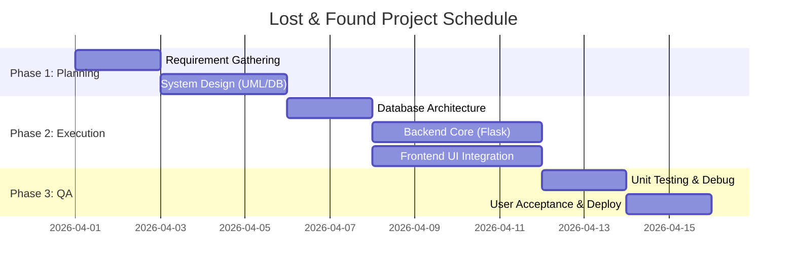
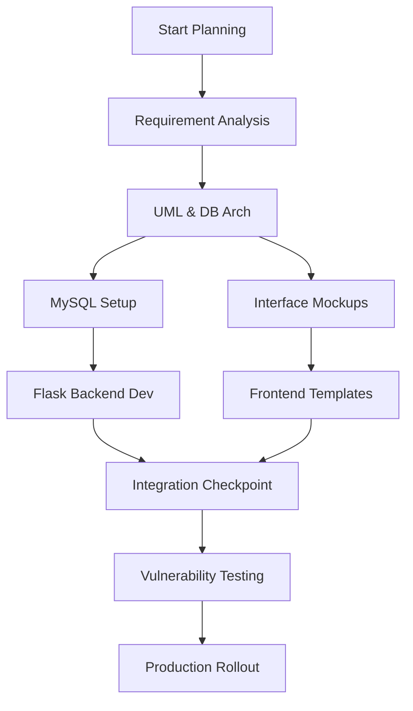
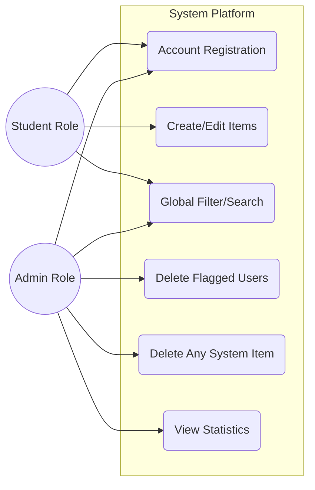
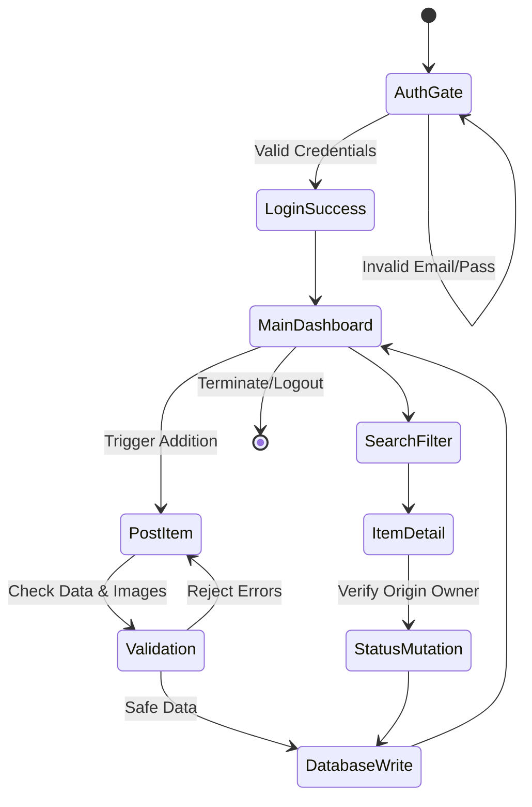
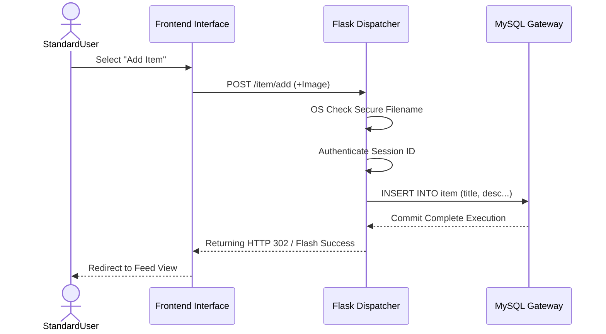
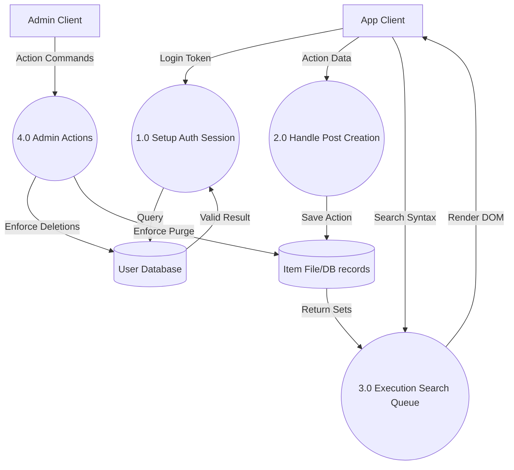
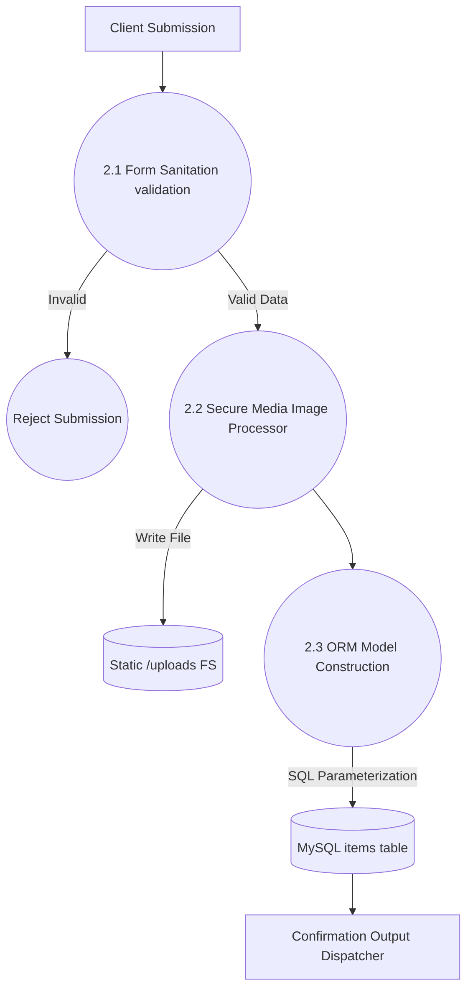
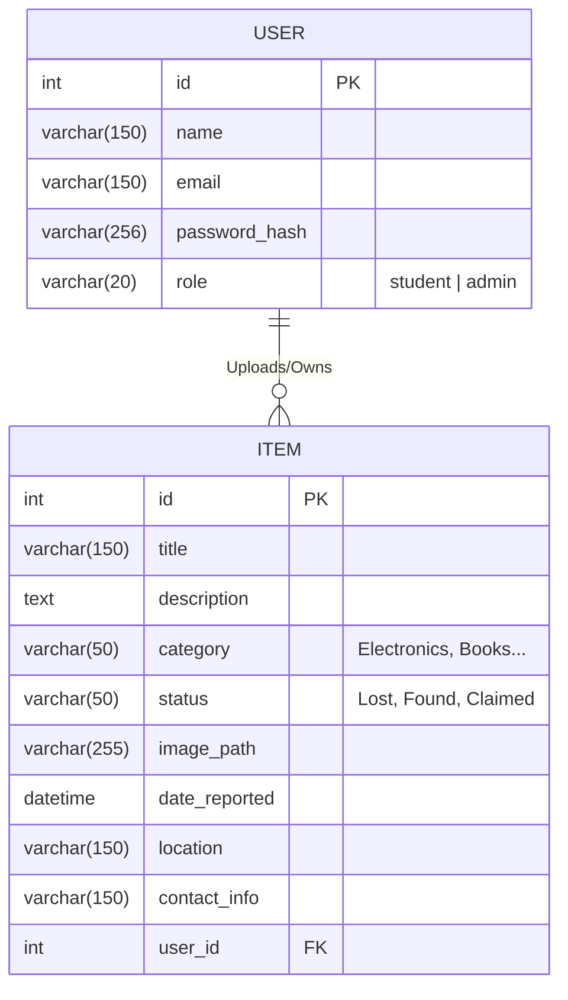

# Software Requirements Specification (SRS)
**Project Title:** College Campus Lost & Found System
**Standard:** IEEE-830 Format

---

## 1. Introduction

### 1.1 Purpose
The purpose of this document is to define the software requirements for the "College Campus Lost & Found System". It specifies the functional and non-functional requirements, and architectural design strategies for the final system deployment.

### 1.2 Scope
The web portal aims to centralize the reporting of lost and found items securely across a college campus. It utilizes a MySQL relational database managed dynamically by a Python Flask architecture. The portal features role-based access controls explicitly distinguishing `Student` clients and organizational `Admin` moderators.

### 1.3 Definitions, Acronyms, and Abbreviations
- **SRS:** Software Requirements Specification
- **ERD:** Entity Relationship Diagram
- **DFD:** Data Flow Diagram
- **SQL:** Structured Query Language
- **ORM:** Object Relational Mapper

## 2. Overall Description

### 2.1 Product Perspective
The system functions as a modular standalone web framework accessible over HTTP/HTTPS natively on smart devices and laptops minimizing friction via responsive web layout optimizations.

### 2.2 User Classes and Characteristics
1.  **Students (End Users):** Capable of signing up, authenticating, posting localized claims, isolating attributes (categories), and dictating item statuses (Lost vs Found vs Claimed).
2.  **Administrator (Management):** A superuser controlling a private dashboard that manipulates metrics, globally purges inappropriate content natively, and forcefully disables erratic accounts.

### 2.3 Operating Environment
-   **Client Side:** Modern Web-Browser execution (Chrome, Safari, Firefox, Edge).
-   **Server System:** Application Layer parsed over Python 3.x, Database mounted over MySQL Server 8+.

---

## 3. Diagrams & Project Management Planning

### 3.1 Gantt Chart
Visualizing task progression scheduling standardizing a 2-week implementation lifecycle.

### 3.2 PERT Chart
Illustrating strict milestone task dependencies natively.

### 3.3 Use Case Diagram
Mapping actor access functionality.

### 3.4 Activity Diagram
Flowing state conditional logic for standard user workflow.

### 3.5 Sequence Flow Diagram
Interaction between view layer, backend controller, and SQL schema mappings.

---

## 4. DFD (Data Flow Diagrams)

### 4.1 Level 0 (Context Level Diagram)

### 4.2 Level 1 Diagram

### 4.3 Level 2 Diagram (Exploding 2.0 Item Management)

---

## 5. Database Specification

### 5.1 Entity Relationship Diagram (ERD)

### 5.2 Database Structure in Table Form

**`user` Table**

| Field | Type | Attributes | Description |
| :--- | :--- | :--- | :--- |
| **id** | Integer | **PRIMARY KEY**, Auto Increment | Unique record identifier per user. |
| **name** | Varchar(150) | NOT NULL | User's full legal name. |
| **email** | Varchar(150) | NOT NULL, UNIQUE | Campus email used for authorization logic. |
| **password_hash** | Varchar(256) | NOT NULL | Werkzeug securely encrypted string. |
| **role** | Varchar(20) | NOT NULL, default='student' | Determines access permission elevation. |

**`item` Table**

| Field | Type | Attributes | Description |
| :--- | :--- | :--- | :--- |
| **id** | Integer | **PRIMARY KEY**, Auto Increment | Master identification for platform objects. |
| **title** | Varchar(150) | NOT NULL | Short descriptor / Header. |
| **description** | Text         | NOT NULL | Elaborated visual descriptors/warnings. |
| **category** | Varchar(50)  | NOT NULL | Group selector (Accessory, Laptop etc.) |
| **status** | Varchar(50)  | NOT NULL | State tracking indicator. |
| **image_path** | Varchar(255) | NULLABLE | Relative static file directory mapper link. |
| **date_reported**| DateTime     | NOT NULL, default=NOW() | Automatically logs upload timing. |
| **location** | Varchar(150) | NOT NULL | Where physically it was lost/discovered. |
| **contact_info** | Varchar(150) | NOT NULL | Phone or instructions to meet/verify identity. |
| **user_id** | Integer      | **FOREIGN KEY** (user.id) | Author tracing relationship schema. |

---
**End of IEEE 830 Specification Documents.**
